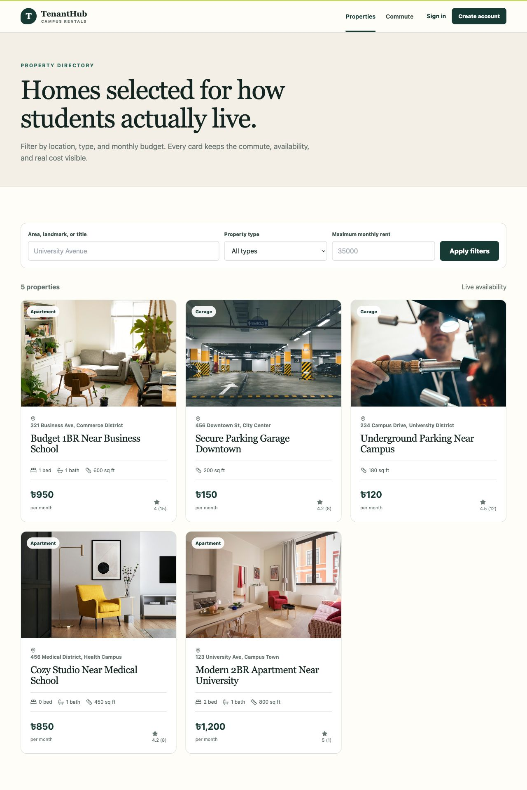
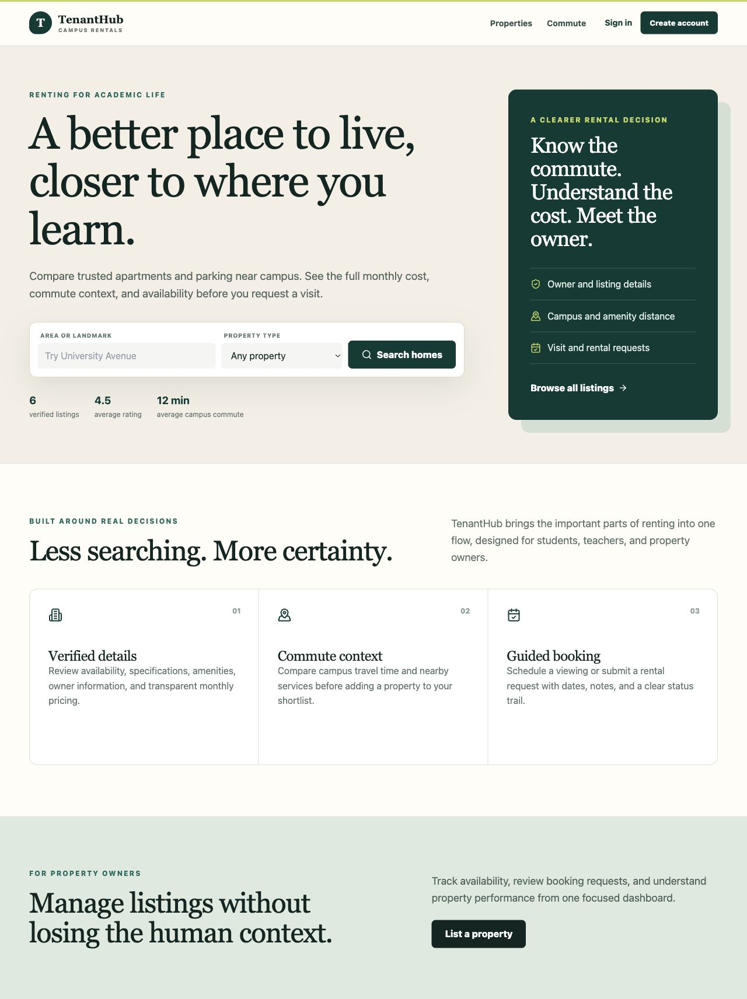
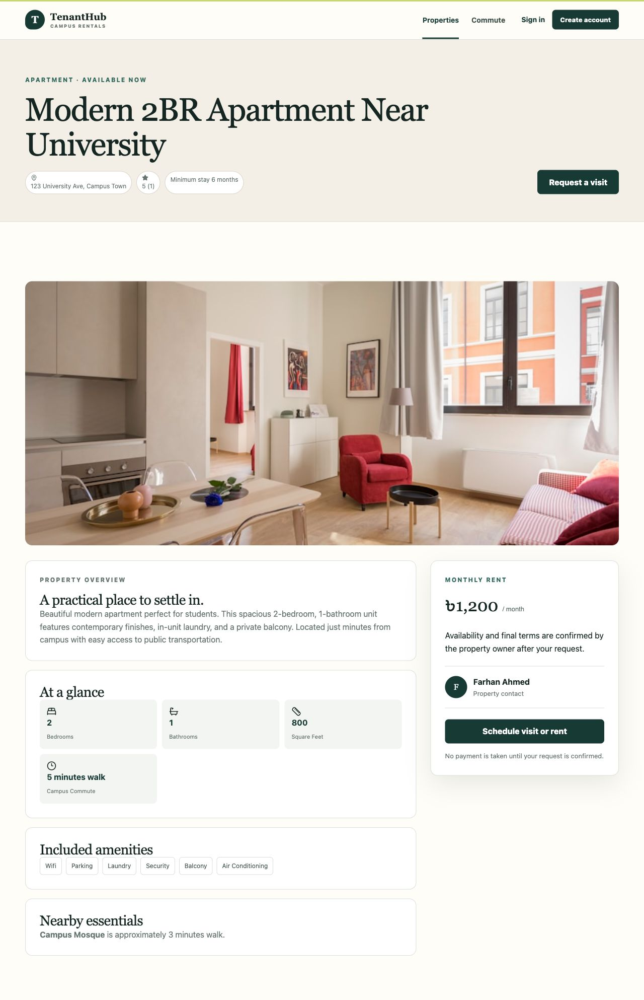
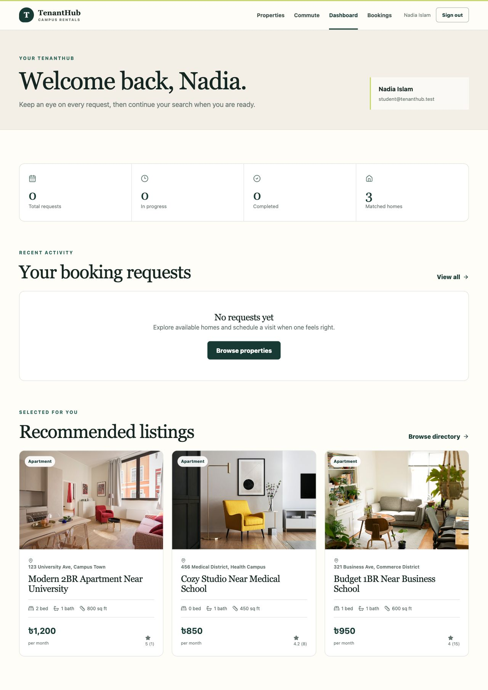
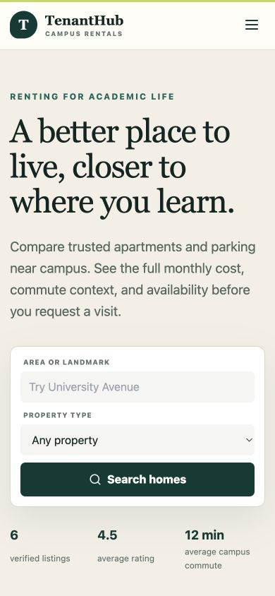
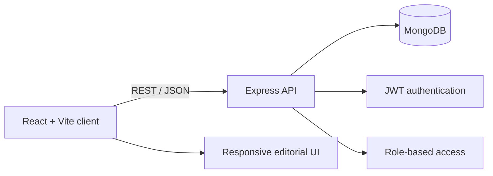

# TenantHub

Campus-focused rental discovery and property management, built for students, teachers, and property owners.

[](https://react.dev/)
[](https://nodejs.org/)
[](https://www.mongodb.com/)
[](LICENSE)



## What it does

- Searches apartments and parking by area, type, and monthly budget.
- Presents price, availability, amenities, commute context, and nearby essentials together.
- Supports visit requests and rental applications with an approval trail.
- Gives tenants, owners, and administrators role-specific workspaces.
- Provides owner listing tools, booking administration, notifications, payments, reviews, and saved commute routes.
- Falls back to curated demonstration listings when the API is unavailable, while clearly labelling live availability.

## Product tour

| Landing page | Property details |
| --- | --- |
|  |  |

| Tenant dashboard | Mobile layout |
| --- | --- |
|  |  |

## Architecture



The repository keeps the client and API separate so either side can be deployed independently:

```text
TenantHub/
├── frontend/            React 19, Vite, responsive UI
├── backend/             Express API, Mongoose models, tests
│   ├── controllers/
│   ├── middleware/
│   ├── models/
│   ├── routes/
│   ├── scripts/         Local demo-data seed
│   └── tests/
├── docs/screenshots/    Verified product captures
└── vercel.json          SPA build and routing configuration
```

## Run locally

Requirements: Node.js 20+, npm, and MongoDB.

```bash
git clone https://github.com/Aurpo-001/TenantHub.git
cd TenantHub
npm run install:all
cp backend/.env.example backend/.env
```

Set a strong `JWT_SECRET` and your local or hosted `MONGODB_URI` in `backend/.env`, then run:

```bash
npm run dev:api
npm run dev:web
```

The web client opens at `http://127.0.0.1:3000`; the API listens at `http://127.0.0.1:5001` by default.

### Demo data

After configuring the database:

```bash
npm --prefix backend run seed
```

| Role | Email | Password |
| --- | --- | --- |
| Tenant | `student@tenanthub.test` | `TenantHub123!` |
| Owner | `owner@tenanthub.test` | `TenantHub123!` |
| Administrator | `admin@tenanthub.test` | `TenantHub123!` |

These accounts are only for local demonstrations. Never reuse their password in a deployed environment.

## Quality checks

```bash
npm test
```

This builds the production client and runs the API contract tests. The current checks cover the health endpoint, JSON 404 response, and CORS rejection for unapproved origins.

## API overview

| Area | Base route | Access |
| --- | --- | --- |
| Authentication | `/api/auth` | Public / authenticated |
| Properties | `/api/properties` | Public browse; owner/admin writes |
| Bookings | `/api/bookings` | Authenticated; admin actions protected |
| Dashboard | `/api/dashboard` | Owner/admin by role |
| Commute | `/api/commute` | Public and authenticated routes |
| Notifications | `/api/notifications` | Authenticated |

See [backend/API_LIST.md](backend/API_LIST.md) for the expanded endpoint inventory.

## Security notes

- Environment files and dependencies are excluded from version control.
- Self-registration can create tenant or owner accounts, never administrators.
- Protected routes validate JWTs and enforce role checks.
- Browser origins are restricted through `CLIENT_ORIGIN`.
- Secrets belong in deployment environment variables, not source files.

For responsible disclosure and deployment guidance, see [SECURITY.md](SECURITY.md).

## License

Licensed under the [MIT License](LICENSE).
